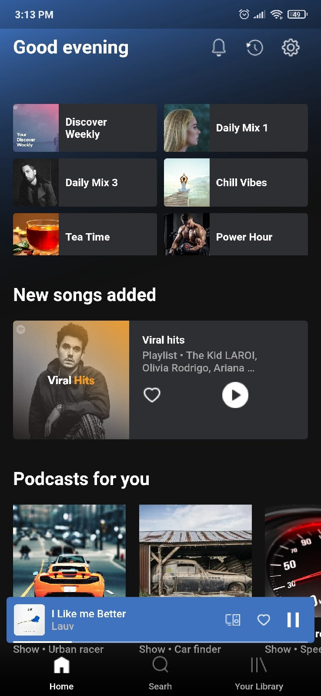
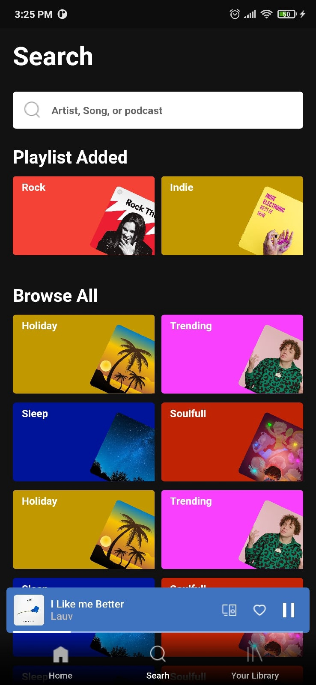
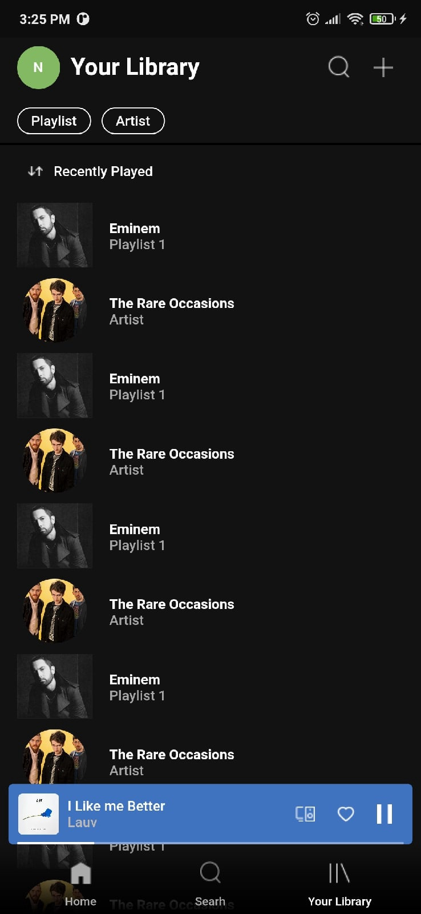
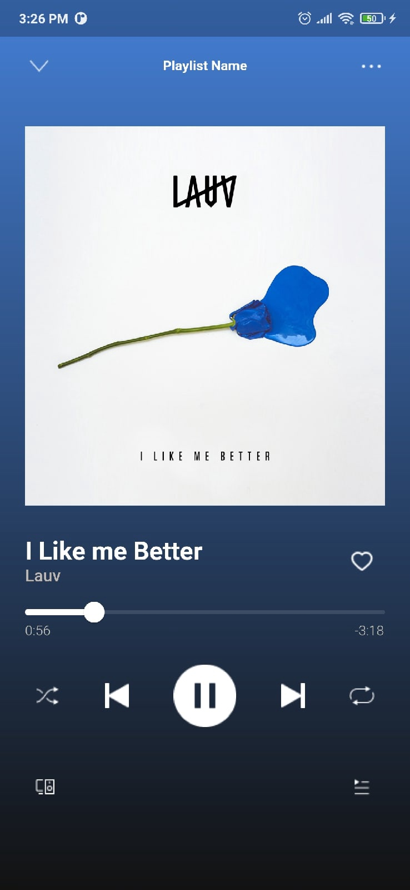

# Spotify Ui clone 

## My Objective

This project showcases how Flutter widgets can be customized to build elegant UIs, using a Spotify-style design as an example.
## What you will create

<!--   -->
<!--   -->

## Getting Started
A few resources to get you started if this is your first Flutter project:

- [Lab: Write your first Flutter app](https://flutter.dev/docs/get-started/codelab)
- [Cookbook: Useful Flutter samples](https://flutter.dev/docs/cookbook)

For help getting started with Flutter, view our
[online documentation](https://flutter.dev/docs), which offers tutorials,
samples, guidance on mobile development, and a full API reference.
